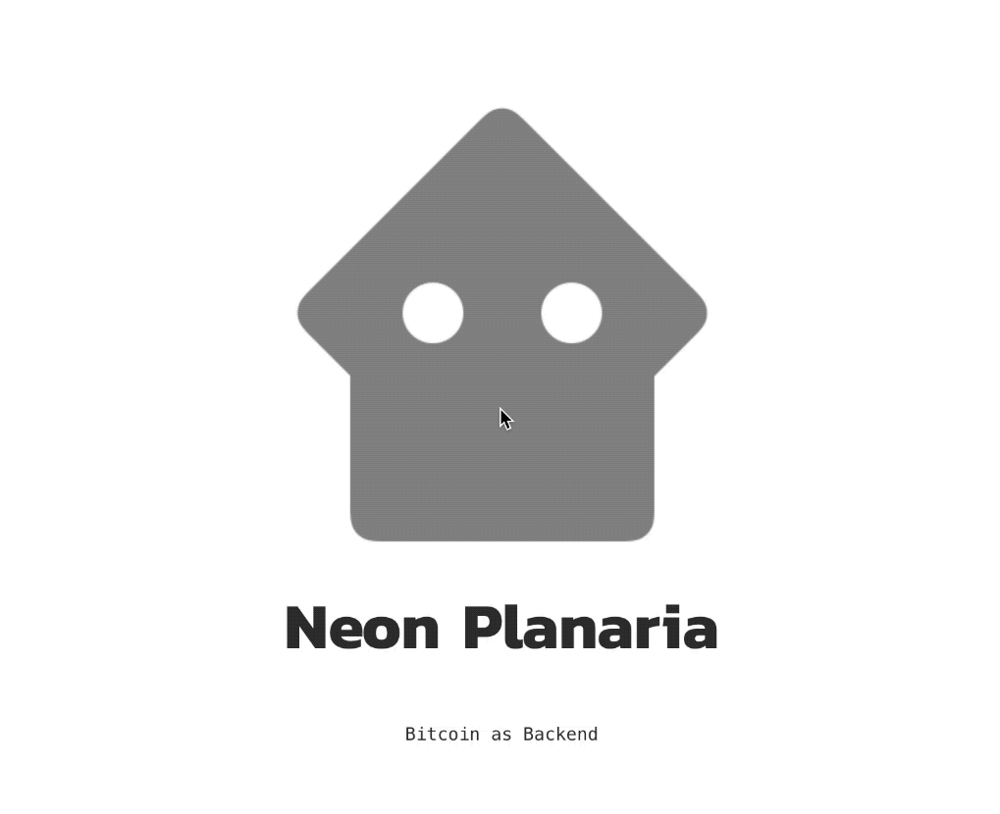

Planaria lets you build ANY API backend system from Bitcoin.

The framework is made up of two components:

1. **Planaria:** Create an autonomous state machine from Bitcoin. Planaria keeps synchronizing itself with the Bitcoin blockchain and programmatically generates a derivative state machine by using Bitcoin transaction events as command. You can derive ANY state machine you want since Planaria lets you write a JavaScript program to transform and store Bitcoin transactions into any format you want.
2. **Planarium:** Create an API endpoint from the generated Planaria state machine. Planarium provides an explorer and an API endpoint, along with a built-in convention to design your own JSON query language like Bitquery.

The modules can be accessed via:

```
const {planaria, planarium} = require('neonplanaria')
```

Learn more:

[Neon Planaria Documentation](https://neon.planaria.network)
